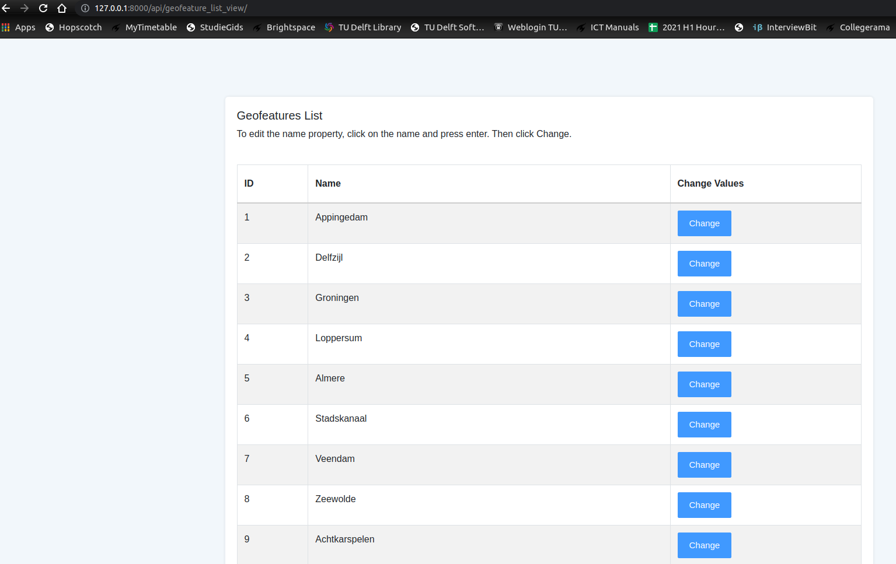

# GeoJSON-REST-API
Django REST API serving vector features in a GeoJSON compatible format.

### 0. Pre-requisites
This application was build using following versions

Python 3.8.10

Postgres Database (12.8)

Django (3.2.6)

Install database using following command: `sudo apt install postgresql postgresql-contrib python3-dev libpq-dev`

Create user and database to test the application
```
sudo -i -u postgres
createuser
createdb
```


### 1. Setup

Clone the repo using: `git clone <repo_path>`

Install the virtual environment using the following command: `pip install virtualenv`

Create the virtual environment as: `virtualenv venv`

Activate the virtual env: `source venv/bin/activate`

Navigate to project directory: `cd geo_json_rest_api/` 

Install the dependencies from requirements.txt: `pip install -r requirements.txt`


### 2. Setting up the Application

Run the following commands from terminal to setup django
```
python manage.py makemigrations
python manage.py migrate
python manage.py createsuperuser
```

Load the data in the database by following command:
```
python api/runnerScript/uploadData.py
```
The data will be uploaded in `GeoFeature` model in the PostGIS database.

Start the application from terminal: `python manage.py runserver`

### 3. Try Out the Application
To test the modules developed for the assignment, follow the below instructions step by step to try out different functionalities.The rest API is tested using the [Postman](https://www.postman.com/). This is needed especially for testing JWT token authorization.  

##### 3.1 CRUD Rest API to get the geodata as json

Open the Postman app and hit the following url: `http://127.0.0.1:8000/api/feature/`

The first page appears and 100 data records are shown per page. Attached screenshot:


To visualize subequent pages change the url to include page number:`http://127.0.0.1:8000/api/feature/?page=2`


##### 3.2 Rest API to filter features by a bounding box coordinates

Open the Postman app and Pass the bounding box in the url, hit the following url for instance: `http://127.0.0.1:8000/api/boundingboxfilter/?bbox=6.885405186403255,53.345128040081015
`


##### 3.3 Testing JWT tokens for authorization

Uncomment the line 110 in file `api/setting.py`, i.e. `'DEFAULT_PERMISSION_CLASSES': ('rest_framework.permissions.IsAuthenticated',),` and restart the application.
We test this using Postman app.

The first step is to generate the token. For this we use django superuser credentials. To do this, pass the username and password via POST request by hitting the following url: `http://127.0.0.1:8000/api/token`


Save these tokens for future reference

Then to verify that token works, pass the token via post request and verify that it returns no error.


##### 3.4 Visualize the GeoSpatial Data on frontend
Make sure to comment back the line 110 in file `api/setting.py`, i.e. `# 'DEFAULT_PERMISSION_CLASSES': ('rest_framework.permissions.IsAuthenticated',),` before testing this part.

To visualize the geospatial data, hit the following url from a web browser: `http://127.0.0.1:8000/api/visualize_geo_data/`


##### 3.5 Edit the properties of geospatial data

In the provided data, we only have one property `name` for the geospatial data. Hence, it was tested only for name, but it should work in a similar fashion for other attributes too.

First we visualize the attributes for the data. For this hit the following url: `http://127.0.0.1:8000/api/geofeature_list_view/`



Edit the attributes and click change


